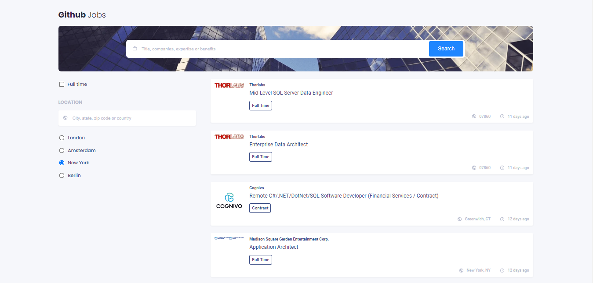

<h1 align="center">{Github Jobs}</h1>

<div align="center">
  <h3>
    <a href="https://github-jobs-refactored-daniel.netlify.app/">
      Demo
    </a>
    <span> | </span>
    <a href="https://github.com/voromahery/github-jobs">
      Solution
    </a>
  </h3>
</div>

<!-- TABLE OF CONTENTS -->

## Table of Contents

- [Overview](#overview)
  - [Built With](#built-with)
- [Features](#features)
- [How to use](#how-to-use)
- [Contact](#contact)
- [Acknowledgements](#acknowledgements)

<!-- OVERVIEW -->

## Overview



- Feel free to visit my demo at [https://github-jobs-daniel.netlify.app/](https://github-jobs-refactored-daniel.netlify.app/)

### Built With

- [React](https://reactjs.org/);

## Features

- [CSS](https://developer.mozilla.org/en-US/docs/Web/CSS)
- [React](https://reactjs.org/)

## How To Use

To clone and run this application, you'll need [Git](https://git-scm.com) and [Node.js](https://nodejs.org/en/download/) (which comes with [npm](http://npmjs.com)) installed on your computer. From your command line:

```bash
# Clone this repository
$ git clone https://github.com/your-user-name/your-project-name

# Install dependencies
$ npm install

# Run the app
$ npm start
```

## Acknowledgements

- [date-fns](https://www.npmjs.com/package/date-fns)

- [React](https://reactjs.org/docs/dom-elements.html)

## Contact

- Email: daniel.her@onja.org
- Phone: +2613791472
- GitHub [@voromahery](https://github.com/voromahery)
